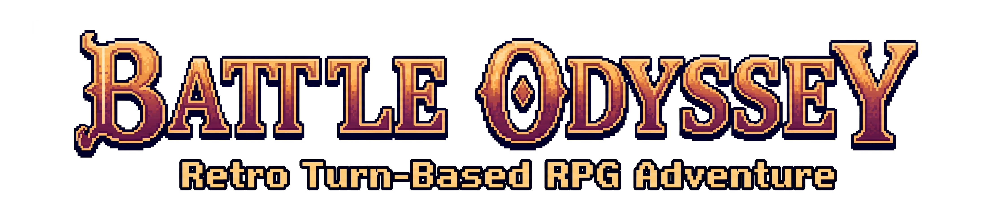

<p align="center">
  
</p>

<h1 align="center">⚔️ BATTLE ODYSSEY API</h1>

<p align="center">
  REST API in Laravel for a turn-based RPG. Choose a character and fight enemies across multiple battles.
</p>

<p align="center">
  
  
  
  
  
  
</p>

---

## 📚 Table of Contents

- [About](#-about)
- [Architecture](#-architecture)
- [Stack](#-stack)
- [Features](#-features)
- [API Overview](#-api-overview)
- [Authentication](#-authentication)
- [Database](#-database)
- [Getting Started](#-getting-started)
- [Tests](#-tests)
- [API Documentation](#-api-documentation)
- [Project Structure](#-project-structure)
- [Author](#-author)

---

## 📖 About

**Battle Odyssey API** is a REST API built with Laravel that powers the game logic of Battle Odyssey.

It provides:

- authentication with access tokens
- character management
- enemy management
- skill management
- game sessions
- turn-based battles
- admin capabilities

Responses are JSON over HTTP under `/api/v1`.

---

## 🏛️ Architecture

```text
React/Vite Frontend
        │
        │ HTTP / JSON
        ▼
Laravel REST API
        │
        ▼
      MySQL
```

The backend owns the game rules, validation and persistence. Any HTTP client can consume it, but the API is fully usable on its own.

---

## 🛠 Stack

| Technology | Usage |
|---|---|
| **PHP 8.4+** | Application language |
| **Laravel 13** | Framework, routing, validation, Eloquent |
| **Laravel Passport** | OAuth2 Bearer-token authentication (`auth:api` guard) |
| **MySQL** | Project database |
| **Pest / PHPUnit** | Feature test suite (`php artisan test`) |
| **Scribe** | Auto-generated API documentation (`/docs`) |

> `laravel/sanctum` is present in `composer.json` but authentication is handled with Passport.

---

## ✨ Features

- 🔐 **Authentication** — register, login, logout and profile (`/me`) with Bearer tokens.
- 🧙 **Characters** — players can list and view characters with skills; admins manage them.
- 👹 **Enemies** — full CRUD reserved for admins, with skills included on detail.
- ⚔️ **Skills** — players can list and view; only admins can create, edit or delete.
- 🎮 **Games** — players start a new game and load their active game.
- ⚔️ **Battles** — players start battles, check status, update outcome and review history per game.
- 🛡️ **Admin** — user management plus full control over characters, enemies and skills.

Also included:

- Role-based access: Public / Player / Admin.
- Validation with FormRequests.
- Scribe docs + Postman collection.
- Pest feature tests per resource.

---

## 📋 API Overview

Base URL: `http://localhost:8000/api/v1/`

Full reference lives in Scribe (`/docs`). This is only an overview.

### Authentication & Profile

| Method | Endpoint | Description | Auth |
|---|---|---|---|
| POST | `/api/v1/register` | Register a new player | Public |
| POST | `/api/v1/login` | Login and receive Bearer token | Public |
| POST | `/api/v1/logout` | Revoke current access token | 🔑 Player |
| GET | `/api/v1/me` | View own profile | 🔑 Player |
| PUT | `/api/v1/me` | Update own profile | 🔑 Player |
| DELETE | `/api/v1/me` | Delete own account | 🔑 Player |

### Admin — Users

| Method | Endpoint | Description | Auth |
|---|---|---|---|
| GET | `/api/v1/users` | List all users | 🛡️ Admin |
| GET | `/api/v1/users/{user}` | View user details | 🛡️ Admin |
| PUT | `/api/v1/users/{user}` | Edit any user profile | 🛡️ Admin |
| DELETE | `/api/v1/users/{user}` | Delete any user | 🛡️ Admin |

### Characters

| Method | Endpoint | Description | Auth |
|---|---|---|---|
| GET | `/api/v1/characters` | List all characters | 🔑 Player / 🛡️ Admin |
| GET | `/api/v1/characters/{character}` | Character details with skills | 🔑 Player / 🛡️ Admin |
| POST | `/api/v1/characters` | Create a character | 🛡️ Admin |
| PUT | `/api/v1/characters/{character}` | Edit a character | 🛡️ Admin |
| DELETE | `/api/v1/characters/{character}` | Delete a character | 🛡️ Admin |

### Enemies

| Method | Endpoint | Description | Auth |
|---|---|---|---|
| GET | `/api/v1/enemies` | List all enemies | 🛡️ Admin |
| GET | `/api/v1/enemies/{enemy}` | Enemy details with skills | 🛡️ Admin |
| POST | `/api/v1/enemies` | Create an enemy | 🛡️ Admin |
| PUT | `/api/v1/enemies/{enemy}` | Edit an enemy | 🛡️ Admin |
| DELETE | `/api/v1/enemies/{enemy}` | Delete an enemy | 🛡️ Admin |

### Skills

| Method | Endpoint | Description | Auth |
|---|---|---|---|
| GET | `/api/v1/skills` | List all skills | 🔑 Player / 🛡️ Admin |
| GET | `/api/v1/skills/{skill}` | Skill details | 🔑 Player / 🛡️ Admin |
| POST | `/api/v1/skills` | Create a skill | 🛡️ Admin |
| PUT | `/api/v1/skills/{skill}` | Edit a skill | 🛡️ Admin |
| DELETE | `/api/v1/skills/{skill}` | Delete a skill | 🛡️ Admin |

### Games & Battles

| Method | Endpoint | Description | Auth |
|---|---|---|---|
| GET | `/api/v1/games` | Load active game | 🔑 Player |
| POST | `/api/v1/games` | Start a new game | 🔑 Player |
| POST | `/api/v1/battles` | Start a new battle | 🔑 Player |
| GET | `/api/v1/battles/{battle}` | View battle status | 🔑 Player |
| PUT | `/api/v1/battles/{battle}` | Update battle outcome | 🔑 Player |
| GET | `/api/v1/games/{game}/battles` | List game battle history | 🔑 Player |

---

## 🔐 Authentication

Built with **Laravel Passport** (`auth:api` guard).

```text
Login
  ↓
Access token
  ↓
Authorization: Bearer <token>
  ↓
Protected API endpoints
```

Login:

```bash
curl -X POST http://localhost:8000/api/v1/login \
  -H "Content-Type: application/json" \
  -d '{"email":"test@example.com","password":"password"}'
```

Then use the token:

```bash
curl http://localhost:8000/api/v1/me \
  -H "Authorization: Bearer <token>"
```

---

## 🗄️ Database

Main relations:

```text
User
 ├── Games
 │    └── Battles
 │         ├── Character (belongsTo)
 │         └── Enemies (M:N via battle_has_enemy)
 │
Character ── Skills (M:N via character_has_skill)
Enemy ────── Skills (M:N via enemy_has_skill)
```

Notes:

- A `Game` also belongs to a `Character` (`games.character_id`).
- A `Battle` belongs to a `Game` and to a `Character`.
- Enemies in a battle are many-to-many with pivot data (`current_hp`, `current_mp`).

The project database is **MySQL**. Note that `.env.example` ships with `DB_CONNECTION=sqlite` by default, so for local development configure `.env` for MySQL as shown below. `.env.example` is intentionally left unchanged.

---

## 🚀 Getting Started

### Prerequisites

- PHP 8.4+
- Composer
- MySQL

### Installation

1. Clone the repository

```bash
git clone https://github.com/M3lgone/battle-odyssey-api.git
cd battle-odyssey-api
```

2. Install dependencies

```bash
composer install
```

3. Set up environment

```bash
cp .env.example .env
```

4. Generate app key

```bash
php artisan key:generate
```

5. Generate Passport keys

```bash
php artisan passport:keys
```

6. Edit the following in `.env`:

```ini
APP_NAME="Battle Odyssey API"
APP_ENV=local
APP_DEBUG=true
APP_URL=http://localhost:8000

FRONTEND_URL=http://localhost:5173

DB_CONNECTION=mysql
DB_HOST=127.0.0.1
DB_PORT=3306
DB_DATABASE=battle_odyssey_api
DB_USERNAME=root
DB_PASSWORD=
```

| Variable | Why it matters |
|---|---|
| `DB_*` | MySQL connection used by the project |
| `APP_URL` | Base URL for the API and docs links |
| `FRONTEND_URL` | Allowed frontend origin (CORS) |

7. Run migrations and seed the database (this also initializes Passport clients)

```bash
php artisan migrate --seed
```

8. Start the server

```bash
php artisan serve
```

9. Generate API documentation (optional)

Scribe docs are served from the app. Regenerate only when needed:

```bash
php artisan scribe:generate
```

Access:

- API → http://localhost:8000/api/v1/
- Docs → http://localhost:8000/docs

---

## 🌱 Seed Data

Development credentials created by the seeders. Do not use in production.

| Role | Email | Password |
|---|---|---|
| Admin | admin@example.com | admin123 |
| Player | test@example.com | password |

Seeders also load characters, skills and their relations (e.g. Warrior–Slash, Mage–Fireball, Goblin–Hack).

---

## 🧪 Tests

Feature suite with Pest / PHPUnit. `phpunit.xml` runs on SQLite in-memory for testing.

Run all tests:

```bash
php artisan test
```

Run a specific file:

```bash
php artisan test tests/Feature/Auth/RegisterTest.php
```

---

## 📚 API Documentation

Interactive documentation generated with **Scribe**:

- Local docs → http://localhost:8000/docs
- Regenerate → `php artisan scribe:generate`
- Postman → open `/docs`, click **View Postman collection** and import it.

Use the seed credentials above to try protected endpoints.

---

## 📁 Project Structure

```text
app/
├── Http/
│   ├── Controllers/Api/  # Auth, Users, Characters, Enemies, Skills, Games, Battles
│   ├── Middleware/       # e.g. Role middleware
│   └── Requests/         # Validation (FormRequests)
├── Models/               # User, Game, Battle, Character, Enemy, Skill
├── Services/             # GameService, BattleService (game rules)
└── Providers/

database/
├── migrations/           # users, characters, skills, enemies, games, battles + pivots + oauth
└── seeders/              # Admin, Characters, Skills, Enemies + relations

routes/
├── api.php               # versioned routes under /api/v1
└── web.php               # docs + web entry

tests/
└── Feature/              # Auth, Users, Characters, Enemies, Skills, Games, Battles
```

---

## 👤 Author

Ismael Gonzalez
